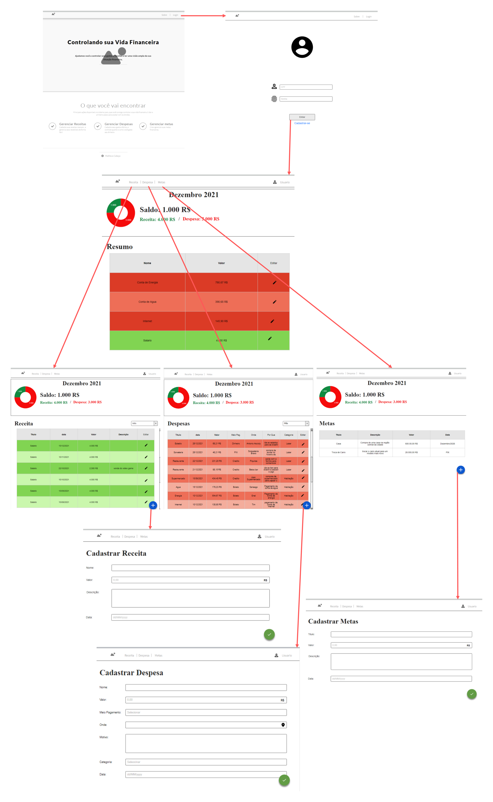

# Sistema Financeiro Front-end

Este é o front-end do projeto de conclusão do curso de **Engenharia de Software**.

A ideia e construir um sistema que facilite a população ter um controle de suas financias para ajudar a se livrar das dividas, conquistar suas metas como Casa propria, meio de transporte, viagem do sonho etc..

## Run

``npm start``

apos iniciar abrir o endereço [http://localhost:3000](http://localhost:3000) para visualizar o front da aplicação. 

# fluxo das telas

[Fluxo em PDF](./resource/telas/fluxodetelas.pdf)

video do fluxo grama

[link do prototipo de fluxo](https://app.moqups.com/8ZsfM1H1KGRDxuvSzI8tnv8th5R67XTv/edit/page/aa9df7b72)

# Api back-end de Produção

https://granada-matheus-calaca-puc.herokuapp.com/swagger-ui/#/
